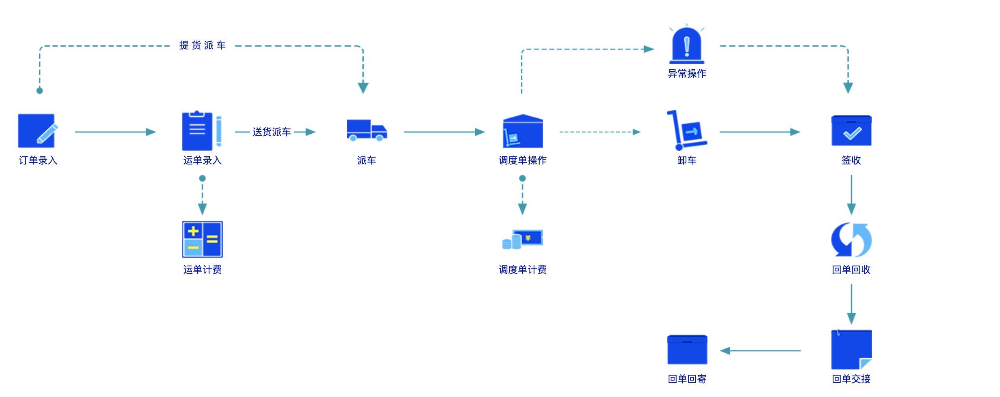
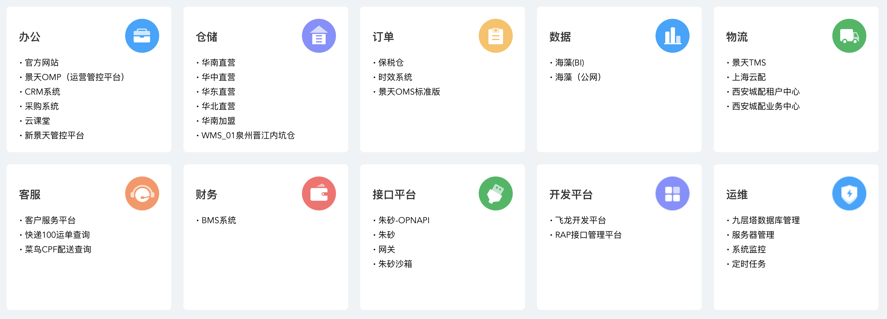
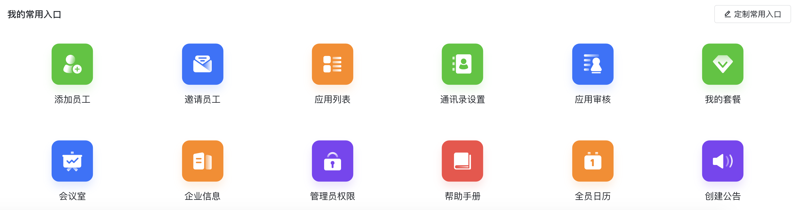
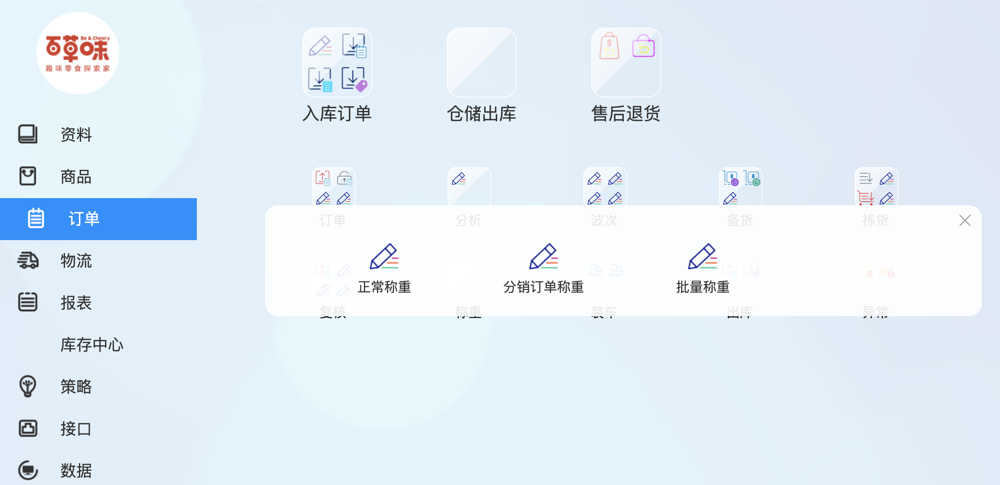

说明：主要说下BS模式的产品导航，不谈论PC端产品

## 1 导航的作用

导航在一个系统中有着很重要的作用，1是让登录的用户看到有哪些可用的功能，2是给用户提供进入各个系统的捷径，当系统逐渐复杂，功能逐渐多的时候，就要求在设计导航时一定要清晰明了，用户一看就知道某个功能位于哪个地方。

## 2 导航的形式

目前常用的导航形式有4种：1是边栏形式（左边栏，边栏），一般包含多个层级，是最常见的导航形式；2是流程形式，常见于业务流程比较复杂的系统；3是hao123形式，常见于阿里云、腾讯云等功能特别多的系统中；4是应用模式，目前使用的系统的较少，可能是未来发展的方向，但需要功能模块有清晰的定义并且容易让用户找到；5是多种形式结合的，这也是目前大多数平台类B端系统采用的方式，一是因为越来越多功能无法设置菜单，二是菜单层级导致不容易找到；6是与搜索结合的导航，根据岗位角色自动推荐的菜单，根据需要展示对应的菜单；7是卡片簇形式。

每种的形式都有自己的使用场景，具体在哪种产品上使用，需要结合用户的认知和使用系统来确定。

下面举几个上面说的各种形式的例子：

### 2.1 左边栏形式

### 2.2 流程形式

按照单据操作流程展示不同的菜单，方便用户理解单据的流向。

### 2.3 hao123形式

一般仅仅展示系统名字，很少用于具体页面的展示。

### 2.4 应用形式

### 2.5多种形式结合

点击上方不同的列表，下方展示不同的菜单，是上方列表，左侧列表和hao123导航形式的结合，并且上方也提供了搜索。

### 2.6 卡片形式

这种形式较为少见，但在一些仓储ERP中较常见，一般的系统使用这种可能会不太适用。

## 3 导航的内容

导航上面的主要内容就是让用户看见之后能够立即明白每个菜单的含义，以及能够完成的功能，除此之外也必须简洁，不能包含太多的内容。

常用的使用方法如下：

1.  每一级菜单不超过7项

2.  菜单名字不超过5+-2个字
3.  菜单层级深度不超过4级
4.  菜单名字尽量使用动词，与里面具体的操作有关。
5.  菜单取名要一致

在内容上结合行业常用成语会达到事半功倍的效果，如果有条件的话要对菜单的名字做一下A/B测试。

## 4 菜单分类

菜单的分类主要有两种，单个业务系统内部的菜单分类，以及多个业务系统形成的ERP的内部菜单分类。

对于单个业务系统菜单分类比较简单，一般按照：

1.  操作功能
2.  操作设置
3.  报表

三个来分类，如果菜单还是太多，可以把操作功能再分为公共页面和个人功能，公共页面涉及到数据权限；操作设置可以再分为全局设置和业务单位设置；报表也可以在分为明细，日报表，月报表等等。

个别系统为了让用户看到更多的页面，在页面分类上可能会用比较极端的方法，把每个操作都分为一个页面。这样设计的好处是用户比较容易找到页面，不好的地方是页面太多。当系统足够复杂时不太适用。

对于复杂系统的内部菜单分类，比较多样化，不过也大致分为几类：

1.  按照操作部门来区分，云仓目前在用的方式；
2.  按照业务功能区分，很多平台类企业在用的方式；
3.  按照操作流程区分，很多业务系统常用的方式；
4.  按照操作人员区分，老式ERP常用的方式；

除此之外也有其他不同的按照业务场景、用户、使用方法等等的分类方法。不过大多数系统都是把几种方法结合在一起，然后再结合用户的使用系统来调整菜单。

但不管菜单如何分类一定要有人统一管理，而不是由各个系统自己定义，不然会造成用户的理解混乱。

## 最后

菜单的分类只是为用户提供一个使用系统功能的捷径，最关键的还是提升用户的作业效率，减少用户的操作。在相同的功能内，菜单越少越好。
